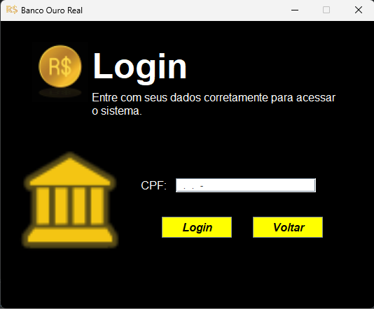
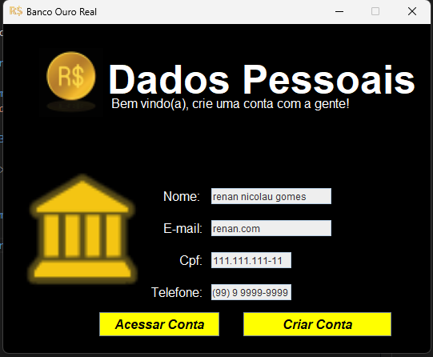
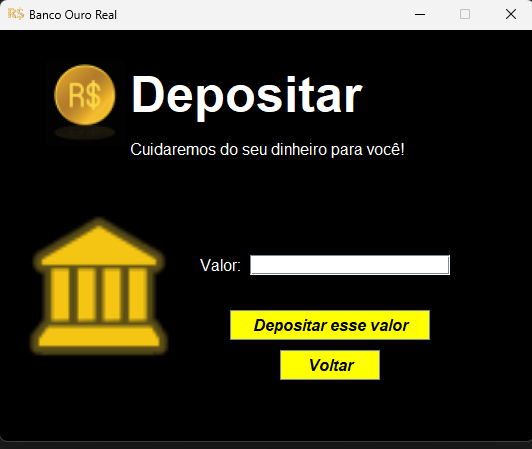
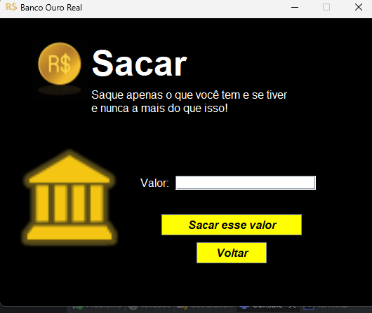

# System_Bank
<em>Estudos para a cadeira de modelagem e programação orientada a objeto.</em>

## Sobre o projeto

✍️ O projeto tem como objetivo servi como estudo de composição, padrão MVC, tratamento de evento e interface gráfica.

* <Strong>Instituição:</Strong> Universidade Federal Rural de Pernambuco - Unidade Acadêmica de Serra Talhada.

* <Strong>Curso:</Strong> Sistemas de Informação.

* <Strong>Cadeira:</Strong> Modelagem e Programção Orientada a Objetos (MPOO).

* <Strong>Dorcente:</Strong> Prof.RICHARLYSON ALVES DEMERY.

* <Strong>Origem do projeto:</Strong> Desenvolver uma interface gráfica simples com os conteúdos abordados na diciplina para a quesstão 4 da lista de exercícios sobre composição.

## Funcionamento do Sistema

✍️ O programa inicia com uma tela de menu principal que possui as opções de logar e fazer cadastro;

 

<h3>Fazer Cadastro</h3>

&emsp; ✍️ O botão fazer cadastrar levará a janela a seguir;

*   Quando as informações forem salvas corretamente você poderá voltar e realizar o login.

 

<h3>Login</h3>

&emsp;✍️ Para entrar é necesário que você já tenha se cadastrado anteriormente.

 

<h3>Dados do Usuário</h3>

&emsp;✍️ Aqui você poderar ver seus dados provenientes do seu cadastro e poderá escolher entre <Strong>acessar uma conta </Strong> ou <Strong>criar uma </Strong>. 

 

<h3>Criar Conta</h3>

&emsp; ✍️ Após a criação da conta, ela já pode ser acessada!

 

<h3>Acessar Conta</h3>

&emsp;✍️ Para acessar uma conta é necessário que o cliente a possua!

 

<h3>Dados da Conta</h3>

&emsp; ✍️ Na interface de conta você pode ver seus dados e realizar operações de deposito e saque.

 

<h3>Deposito</h3>

 

<h3>Saque</h3>

&emsp;✍️ Você só pode realizar um saque se o valor for menor que saldo presente em sua conta ou se a conta não estiver zerada. 

